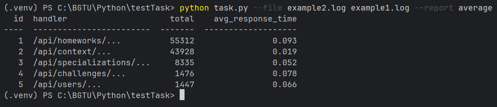
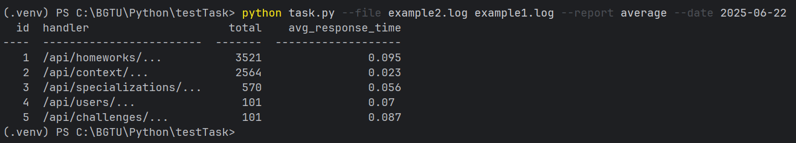
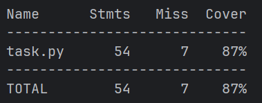

# Python Log Parser

---

## Примеры запуска

Обработка файлов:
```bash
python task.py --file example1.log example2.log --report average
```
С фильтром по дате:
```bash
python task.py --file example1.log example2.log --report average --date 2025-06-22
```

---

## Тесты

### Запуск с двумя файлами


### Запуск с фильтром по дате


### Покрытие тестов
